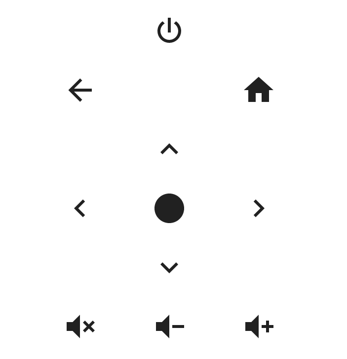

# Xgimi-4-Home-Assistant
  

XGIMI integration for home assistant.  
Please give me a star :star_struck: if you like it.  


## 📦Install
### Manually
1. Copy whole folder `xgimi` into home assistant `custom_components`  
2. Restart home assistant  
### Via HACS
1. Install [HACS](https://hacs.xyz/) if you do not have that already
2. In the Home Assitant HACS Tab, click on the three dots at the top right
3. Choose `Custom repositories`
4. Paste `https://github.com/manymuch/Xgimi-4-Home-Assistant/` to the repository field, choose the `Integration` category and click `ADD`
5. Close the dialog
6. Disable the repository filter (hit `CLEAR` on the right of the `Filtering by Downloaded` text)
7. Type `Xgimi` to the Search bar and select `Xgimi Projector Remote`
8. Click `DOWNLOAD` on the bottom right
9. Click `DOWNLOAD` in the dialog that just appeared
10. Restart home assistant

## 🏗️Setup
Prepare the following:  
``host``: local IP of the projector, check the router or the setting in the projector's menu.  
``token``: BLE token to power on the projector.  
If you do not want to use poweron feature, you can put random number for ``token`` and you can still control the projector by IP address with all commands (poweroff, volumeup,...) except for poweron. For how to get the token, see below.

### Get your device BLE token

The integration communicates with xgimi projector by UDP using local IP except for the **poweron** command. Once the projector is powered off, the only way to wake it up is sending a special ble advertisement. Such a ble advertisement contains a special token called `manufacture data`. The `manufacture data` is **different for each device**.  

Here is a step by step guide to help you sniffer your device manufacture data(token):  

1. Sniffering the token using an iOS App:    
a. Completely unplug the projector.  
b. Get an iOS device and install [Bluetooth Smart Scanner App](https://apps.apple.com/us/app/bluetooth-smart-scanner/id509978131).  
c. Use the [Bluetooth Smart Scanner App](https://apps.apple.com/us/app/bluetooth-smart-scanner/id509978131) to scan while keep pressing the power on button on the remote. Look for the new BLE advertisement, it may contain a name like ``Bluetooth RC 4.0``.  Find the BLE token in the advertisement.  


2. Now plugin your projector and test the token either (a) with an android device or (b) with a linux device with bluetooth support (e.g. RaspberryPi).  
a. Android app: use [EFR connect](https://play.google.com/store/apps/details?id=com.siliconlabs.bledemo&hl=en&pli=1) to simulate a ble advertisement.  See this [screenshot](https://i.stack.imgur.com/4HLQs.jpg) for how to setup an advertisement accordingly.  
b. Linux terminal, use ``bluetoothctl`` in the terminal:  
    ```bash
    [bluetooth]# menu advertise
    [bluetooth]# uuids 0x1812
    [bluetooth]# manufacturer 0x46 0x7e 0x31 0xdb 0x31 0xb2 0x24 0x40 0xff 0xff 0xff 0x30 0x43 0x52 0x4b 0x54 0x4d
    [bluetooth]# back
    [bluetooth]# advertise on
    ```
    Adjust the the token after the manufacturer according to your projector's model. The first ``0x46`` is the company code followed by the actual manufacturer token.


Either with android app or with linux bluetoothctl, you should now able to poweron the projector without the remote.  
[Here](https://github.com/manymuch/Xgimi-4-Home-Assistant/issues/5#issuecomment-1752887102) provides an alternative way to get the token without iOS or Android device.  


### Choose a method to setup:  
#### Method A: manual setup
1. Add the following lines to your `configuration.yaml`:
    ```yaml
    remote:
    - platform: xgimi
        name: Z6X
        host: 192.168.0.115
        token: "12D7C7899B9F80FFFFFF3043524B544D"
    ```

#### Method B: UI setup
1. Make sure your projector is **powered on** and connected to the same network as home assistant
2. Add new integration, search for xgimi
3. Enter your projector information, for example:
    ```bash
    name: z6x
    host: 192.168.0.115
    token: 12D7C7899B9F80FFFFFF3043524B544D
    ```

## 📺How to use
The integration setup up a remote entity: e.g. `remote.z6x`.  
Example usage of remote.send_command service:  
```yaml
service: remote.send_command
data:
    command: volumeup
target:
    entity_id: remote.z6x
```
Available commands:  
The below commands work for most devices:  
```
play, pause, power, back, home, menu, right, left,
up, down, volumedown, volumeup,
poweron, poweroff, volumemute
```
The below commands may only work for some devices, you can have a try and good luck :-)  
```
autofocus, autofocus_new,
manual_focus_left, manual_focus_right,
motor_left_overstep, motor_left_start,
motor_right_overstep, motor_right_start, motor_stop,
shortcut_setting, choose_source, hibernate, xmusic
```

### Dashboard example
See [tv-card-example.yaml](assets/tv-card-example.yaml) for a dashboard example using [tv-card](https://github.com/marrobHD/tv-card)  
 


### Troubleshoot

1. If you are running Home Assistant with docker, make sure HA is accessible to the bluetooth, see [issue #12](https://github.com/manymuch/Xgimi-4-Home-Assistant/issues/12).  
2. Make sure the bluetooth signal from HA host machine can reach the projector without blockage.  

### More Related threads about BLE token
* [issue #5](https://github.com/manymuch/Xgimi-4-Home-Assistant/issues/5)
* [issue #31](https://github.com/manymuch/Xgimi-4-Home-Assistant/issues/31)
* [stackoverflow question](https://stackoverflow.com/questions/69921353/how-can-i-clone-a-non-paired-ble-signal-from-a-remote-to-trigger-a-device/75551013#75551013)

## TODO
- auto discovery  
- media player entity   


This integration is still in early stage, contributions and suggestions are welcome!  
Please give me a star :star_struck: if you like it.
