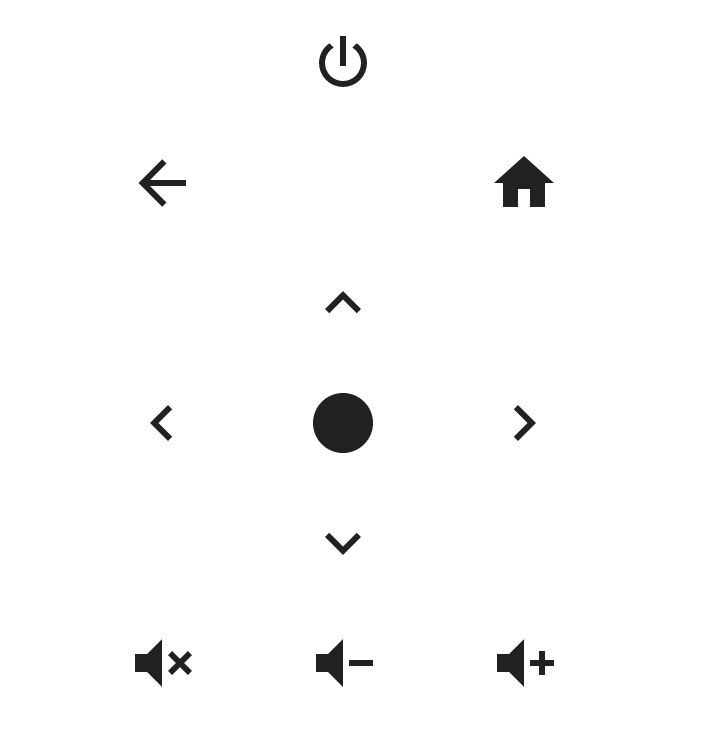

# XGIMI Projector Integration for Home Assistant


Control your XGIMI projector with Home Assistant—power it on or off and use most remote commands.  
Please give me a star 🤩 if you like it.

## 📦Installation

### HACS

[](https://my.home-assistant.io/redirect/hacs_repository/?owner=manymuch&repository=Xgimi-4-Home-Assistant&category=integration)

1. Install [HACS](https://hacs.xyz/).
2. In HACS, open the menu and choose Custom repositories.
3. Add `https://github.com/manymuch/Xgimi-4-Home-Assistant` as an Integration repository.
4. Download XGIMI Projector Remote.
5. Restart Home Assistant.
6. Go to Settings → Devices & services → Add integration, search for XGIMI,
   and complete setup.

### Manual

Download a release and copy `custom_components/xgimi` into the Home Assistant
configuration directory, then restart Home Assistant.

## Finding the BLE token

You need to find the BLE token for your specific device, like:  
``12D7C7899B9F80FFFFFF3043524B544D``  
It is only used for power on, you can still use other features if you don't have the BLE token.  

You can try to figure it out from MAC address (see [issue38](https://github.com/manymuch/Xgimi-4-Home-Assistant/issues/38)), or try to capture the token from your remote using Home Assistant's built-in Bluetooth Advertisement Monitor:  

1. Open Settings → Devices & services → Bluetooth → Configure →
   Advertisement Monitor, or use the
   [Bluetooth Advertisement Monitor shortcut](https://my.home-assistant.io/redirect/bluetooth_advertisement_monitor/).
2. Turn the projector off so the remote is not connected to it.
3. Press the remote's power button.
4. Find manufacturer-data key `70` (decimal 70 is hexadecimal `0x46`).
5. Copy its hexadecimal value only. Do not include the key itself.

Example:

```text
Manufacturer ID: 0x0046
Payload: 51f55a6d78e450ffffff0000000b000d
```

## 🏗️Setup

The setup flow has two stages:

1. Enter the projector name, host/IP address, and choose either **Local
   Bluetooth** or **ESP32**.
2. Complete the selected backend:
   - **Local Bluetooth:** enter the BLE token and choose a concrete,
     advertising-capable local Bluetooth adapter discovered on the Home
     Assistant host.
   - **ESP32:** choose any Home Assistant `button.*` or `input_button.*` entity.

### ESP32 wake backend

If you HA host device does not have bluetooth, you can have a ESP32 device to emit the BLE wake advertisement. See this example [`assets/esphome-xgimi-wake.yaml`](assets/esphome-xgimi-wake.yaml), you need to edit the file with your own token.    
Then choosing ESP32 wake backend, and select a `button.*` or `input_button.*` entity, the projector's remote entity `turn_on` will just press that button to have ESP32 to wake the projector.

### Local Bluetooth wake backend

The local backend uses the Home Assistant host's system D-Bus and BlueZ
service.  

Options Flow settings:
* Local bluetooth adapter
* Advertisement duration
* Incremental BLE token counter, see [issue 38](https://github.com/manymuch/Xgimi-4-Home-Assistant/issues/38)


## Options and diagnostics

Options Flow also includes:

* Reachability TCP port, default `554`
* State refresh interval, default `30` seconds
* Debug logging

### Home Assistant OS
The implementation uses the host's system BlueZ service directly; no add-on or
helper service is required.

### Home Assistant Container

The Docker host must run BlueZ. Home Assistant must use host networking, access
the host system D-Bus, and have the Bluetooth capabilities required by the host
setup.

On Debian or Ubuntu:

```bash
sudo apt update
sudo apt install -y bluez
sudo systemctl enable --now bluetooth
```

Example Docker Compose configuration:

```yaml
services:
  homeassistant:
    image: ghcr.io/home-assistant/home-assistant:stable
    network_mode: host
    cap_add:
      - NET_ADMIN
      - NET_RAW
    volumes:
      - ./config:/config
      - /etc/localtime:/etc/localtime:ro
      - /run/dbus:/run/dbus:ro
```

Then verify the adapter and D-Bus socket, recreate the container, and select a
concrete adapter in the XGIMI setup flow:

```bash
bluetoothctl list
docker exec homeassistant test -S /run/dbus/system_bus_socket
```

Do not start another `bluetoothd` inside the Home Assistant container. A
missing D-Bus mount or insufficient Bluetooth permissions is reported as a
local Bluetooth repair issue.

## Remote commands

The integration creates one remote entity, such as
`remote.z6x`.

```yaml
action: remote.send_command
target:
  entity_id: remote.living_room_xgimi
data:
  command: volumeup
```

Common commands:

```text
play, pause, power, back, home, menu, right, left,
up, down, volumedown, volumeup, poweron, poweroff, volumemute
```

Model-dependent commands:

```text
autofocus, autofocus_new,
manual_focus_left, manual_focus_right,
motor_left_overstep, motor_left_start,
motor_right_overstep, motor_right_start, motor_stop,
shortcut_setting, choose_source, hibernate, xmusic
```

`poweron` uses the configured wake backend. Every other command continues to
use the existing UDP implementation.

## Troubleshooting

- Enable debug logging and download integration diagnostics.
- For local Bluetooth, verify the host BlueZ service, system D-Bus access,
  `/run/dbus:/run/dbus:ro`, `NET_ADMIN`, and `NET_RAW` where applicable.
- For ESP32, verify that the selected Home Assistant `button` or `input_button`
  is present and that the hardware behind it can transmit the wake packet.
- If LAN commands do not work, the projector may use native Android TV control.
  Consider Home Assistant's
  [Android TV Remote](https://www.home-assistant.io/integrations/androidtv_remote/)
  integration for those commands.

## Dashboard example

See [`assets/tv-card-example.yaml`](assets/tv-card-example.yaml) for an example
using [tv-card](https://github.com/marrobHD/tv-card).


